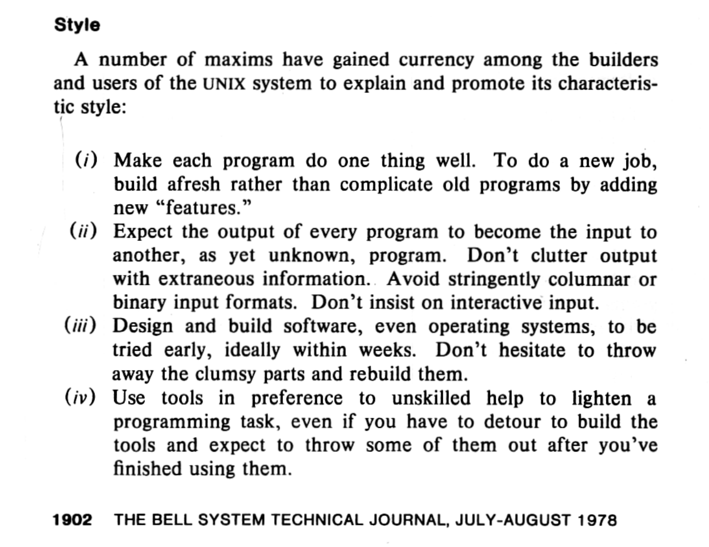

---
title:
- Git and the Command Line
author:
- Ted Burke
date:
- Fri 20 Oct 2023
theme:
- default
fonttheme:
- structurebold
colortheme:
- default
header-includes:
- \setbeamercolor{normal text}{fg=black,bg=yellow!15}

---

# Git is great!

## Contents

1. Command line interface (CLI) - tools, demo, philosophy
2. Git's command line interface - commands, workflow demo
3. The power of Vim - modes, motions, commands, shell integration
4. Pair programming with tmux (the terminal multiplexer)

## Command-line interface (CLI)

Although the term "CLI" applies more generally, I'm mostly talking about a shell (I use Bash) running in a terminal (I mostly use xfce4-terminal).

- Basic commands: cd, ls, cp, rm, pwd, etc.
- Text editors: vim, nano
- Useful utilities: wc, seq, column, sort
- Power tools: grep, awk, sed
- Development: gcc, gdb, python, git
- Other: pandoc, octave

## Philosophy

## Philosophy

"Give me six hours to fell a tree and I'll spend the first four sharpening the axe." - (frequently attributed to) Abraham Lincoln

{width=40%}

## Vim Superpowers

{width=25%}

Vim is optimised for text editing rather than text entry.

- modes
- motions / text objects
- shell integration: commands, filters, terminal

## Demo: Auto update website from github repo

- Web pages are stored on github repo.
- Clone repo to local machine for editing.
- Push changes back to github.
- Browse to "tedz.eu/stemensemble/update.php" to automatically clone pages to web host.

